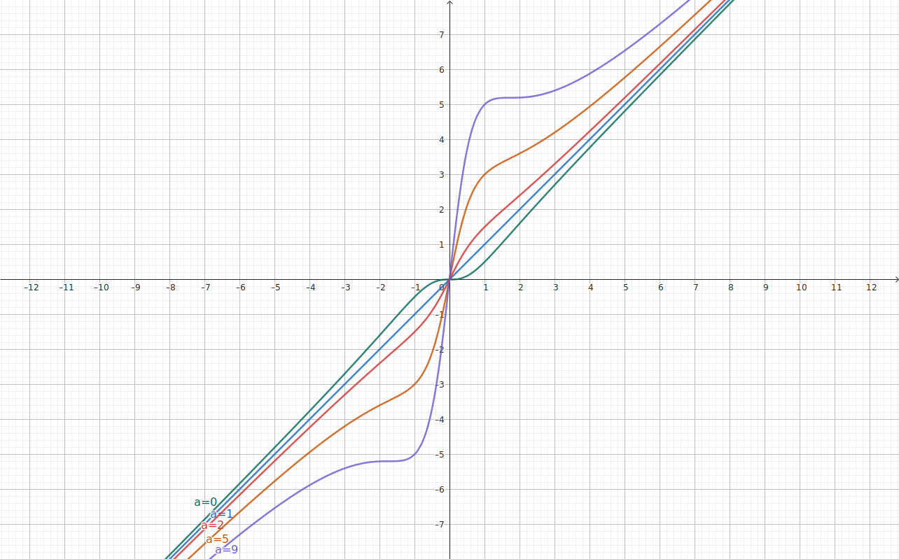
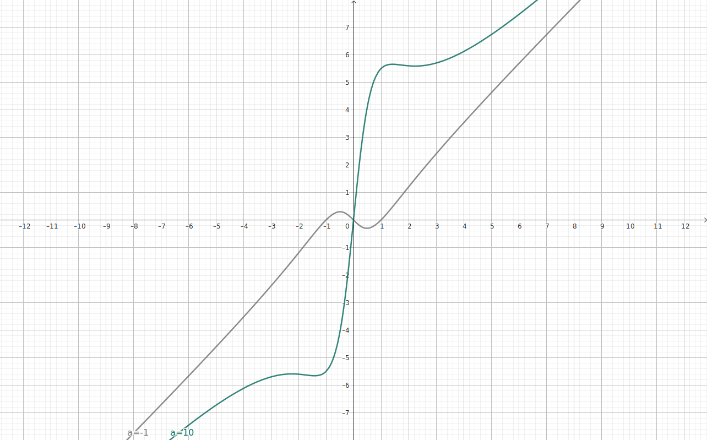

# RaLU - A New Activation Function for Deep Neural Network

**RaLU** (not ReLU!), stands for **Rational Linear Unit**, is a simple, parametric, and gradient-stable activation function designed for Deep Neural Network.

* **Gradient stability** -- Resistant to vanishing/exploding gradient problems.
* **Learnable** -- Can form the best possible shape.
* **Smooth** -- Infinitely differentiable at all points.
* **Zero-centered** -- Beneficial for training.
* **Unbouded output range** -- No "dead neuron".

## Definition

```math
\begin{split}
\text{RaLU}_{a}(x) &= x \frac{x^{2} + a}{x^{2} + 1} \\
\frac{d}{dx}\text{RaLU}_{a}(x) &= \frac{x^{4} + (3-a)x^{2} + a}{(x^{2} + 1)^{2}}
\end{split}
```

$`a (\in \mathbb{R})`$ is a learnable parameter.




* Gradient is $a$ at $`x=0`$.
* It asymptotes to the identity function at $`x \to \pm \infty`$, regardless of $`a`$.
* $`a=1`$ gives an indentity function.
* $`0 \le a \le 9`$ gives a monotonic increasing function.
    * Gradient is $0$ at $`x=0`$ when $`a=0`$.
    * Gradient is $0$ at $`x= \pm \sqrt{3}`$ when $`a=9`$.
    * It loses its monotonically increasing property when $`a<0`$ or $`a>9`$.

## Why for DNN?

### Resistant to vanishing/exploding gradient problems

It asymptotes to the identity function at $`x \to \pm \infty`$ and the gradient is $1$.

In other words, it is unlikely to cause a vanishing/exploding gradient even when layered and is well suited for regression problems, CV (CNN), NLP (RNN, Transformer), etc.

### Beneficial for training

It is infinitely differentiable (smooth) for all "x", for any parameter "a".
This property means that it can avoid gradient discontinuities and can lead to more stable training in gradient descent.

Also, it outputs zero mean values because it is a zero-centred odd function.
This prevents systematic bias in the activations.

### No "dead neuron problems"

The output range of RaLU is unlimited (unsaturated).
This could avoid the "Dying ReLU Problem".

### Learnable

It has a parameter so that it can form the best possible shape for each unit or layer.

### Fast and lightweight

It uses only basic arithmetic operations, no exponents or trigonometry.

Therefore it is fast enough, although not as fast as ReLU.
