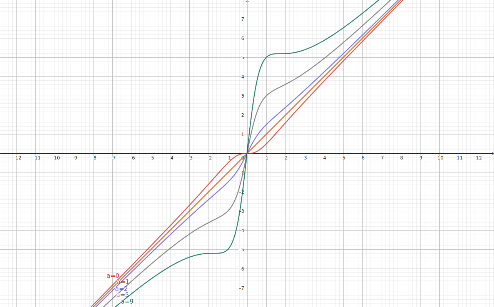

# RaLU - A New Activation Function for Deep Neural Network

RaLU (not ReLU!), stands for "Rational Linear Unit", is a simple, parametric, and gradient-stable activation function designed for Deep Neural Network.

* Gradient stability -- Resistant to loss-of-gradient problems, and not prone to deterioration even when layered.
* Learnable -- Can form the best shape for each unit.
* Smooth -- Infinitely differentiable at all points.
* zero-centered -- Beneficial for training.
* $`\text{RaLU}(\mathbb{R}) = (-\infty, \infty)`$ -- No "dead neuron". Good for regression problem, CV (CNN), NLP (RNN, Transformer), and so on.

## Definition

```math
\text{RaLU}_{a}(x) = x \frac{x^{2} + a}{x^{2} + 1}
```

$`a (\in \mathbb{R})`$ is a learnable parameter.



* It asymptotes to the identity function at $`x \to \pm \infty`$, regardless of $`a`$.
* It is an indentity function when $`a=1`$.
* It is a monotonic increasing function when $`0<a<9`$.
    * Gradient is $0$ at $`x=0`$ when $`a=0`$.
    * Gradient is $0$ at $`x= \pm \sqrt{3}`$ when $`a=9`$.
    * It loses its monotonically increasing property when $`a<0`$ or $`a>9`$.
